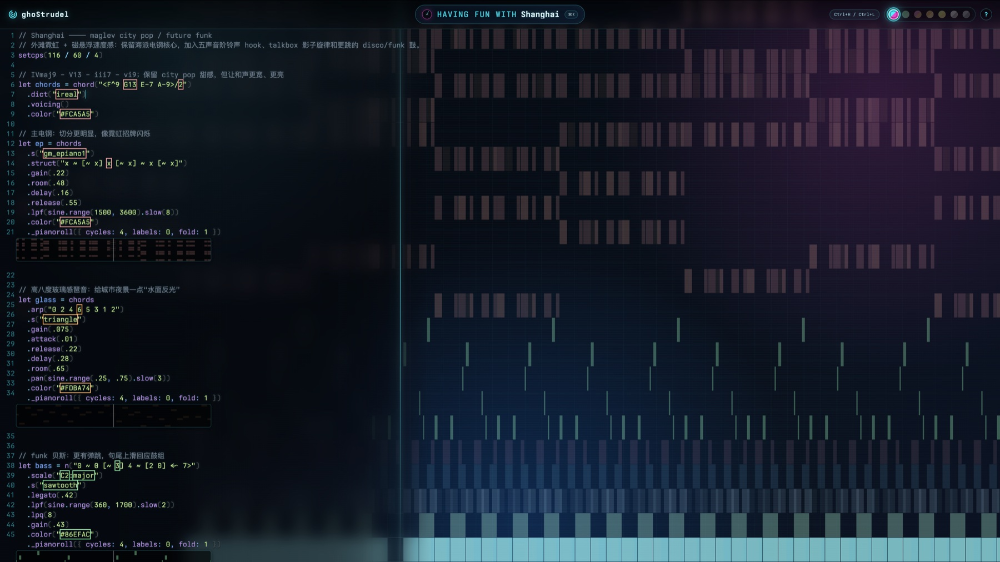

# ghoStrudel

[English](./README.md) · **中文** · [Español](./README.es.md)

ghoStrudel 是一个本地浏览器里的 [Strudel](https://strudel.cc) 编曲 / live-coding 工作台。它提供全屏 Strudel 编辑器、曲目选择器、主题切换，以及 `pianoroll` / `punchcard` 的背景和 inline 可视化。

你可以把自己的 `.strudel.js` 草稿集中放在这里，在浏览器里播放、切换、现场修改，也可以基于内置 sample 曲目快速 remix 出新的编排。



## 快速开始

```bash
bash scripts/serve.sh
```

打开：

```text
http://localhost:8092/
```

停止服务：在启动服务的终端里按 `Ctrl+C`。

## 基本工作流

```text
在 tracks/ 下新建或编辑 .strudel.js 文件
  ↓
打开页面，或按 Cmd/Ctrl + K 切换曲目
  ↓
按 Ctrl + Enter 求值并播放
  ↓
播放时继续改代码，再按 Ctrl + Enter 热替换
```

浏览器 editor 里的改动是临时的，不会自动写回文件。满意的片段需要复制回对应 `.strudel.js` 文件保存。

## 包含什么

- 本地静态 Strudel REPL：通过固定 CDN 地址加载 `@strudel/repl`，无需 `npm install`，没有 `node_modules`。
- 全屏 CodeMirror 编辑器，Strudel 生成的可视化会显示在代码背后 / 下方。
- 自动读取 `tracks/*.strudel.js` 和 `tracks/*.strudel`。
- `Cmd/Ctrl + K` 打开命令面板式曲目切换器。
- 播放中无缝热替换：时钟不断，新 pattern 在当前 cycle 接上。
- 7 套视觉主题，可在 navbar 点击切换，也可用 `Ctrl+H` / `Ctrl+L`。
- `src/cheatsheets.strudel.js` 是一份能播放的 Strudel 语法和视觉速查表。

## 用 sample 曲目做 vibe coding

可以把三首城市 sample 当成编曲模板：

- `tracks/Shanghai.strudel.js` —— city pop / future funk：电钢和弦、funk 贝斯、disco 鼓、五声主旋律。
- `tracks/New-York.strudel.js` —— boom bap / jazz hip-hop：尘土电钢、swing 鼓组、慵懒贝斯、lo-fi 质感。
- `tracks/Dubai.strudel.js` —— desert house / Arabic EDM：Phrygian 音阶、FM 低音、house 鼓、oud 感旋律和手鼓。

推荐的 vibe coding 流程：

1. 复制最接近目标氛围的 sample 到 `tracks/` 下的新文件。
2. 让 coding assistant 保持大体结构：`chords / bass / drums / lead / arrange`。
3. 修改风格、速度、调式、鼓律动、音色选择和乐器分工。
4. 除非明确不需要图形，否则保留可视化调用：
   - 旋律、贝斯、和声声部用 `._pianoroll()`
   - 鼓和节奏声部用 `._punchcard()`
   - 整体编排末尾保留 `.pianoroll(...)` 或 `.punchcard(...)`
5. 刷新页面，或用 `Cmd/Ctrl+K` 切到新曲目，再按 `Ctrl+Enter` 播放。

这样可以在改编曲的同时，保留原来的背景 `pianoroll` / `punchcard` 显示效果。

## 项目结构

```text
index.html                  加载 @strudel/repl，挂载曲目，处理 navbar / 主题 / tutorial
src/cheatsheets.strudel.js  能播放的 Strudel 语法和功能速查表
src/style.css               布局、编辑器透明背景、视觉层级和主题颜色令牌
themes/                     主题 CSS 文件
tracks/                     你的曲目：*.strudel.js / *.strudel
scripts/serve.sh            本地 HTTP 服务脚本，默认端口 8092
```

## 曲目

页面默认打开 **Shanghai**。曲目选择器会自动读取 `tracks/` 下所有 `.strudel.js` / `.strudel` 文件。cheatsheet 固定在列表最上方，作为参考。

URL 直达示例：

```text
http://localhost:8092/?file=tracks/Shanghai.strudel.js
```

带连字符的文件名，例如 `New-York.strudel.js`，会在选择器里显示为空格，同时避免 URL 中出现空格。

## 快捷键

| 快捷键 | 作用 |
|---|---|
| `Cmd/Ctrl + K` | 打开 / 关闭曲目选择器 |
| 选择器内 `↑` / `↓` 或 `Ctrl+P` / `Ctrl+N` | 移动选择 |
| 选择器内 `Enter` / `Esc` | 加载选中曲目 / 关闭 |
| `Ctrl + Enter` | 求值当前代码：播放或应用修改 |
| `Ctrl + .` | 停止 |
| `Ctrl + H` / `Ctrl + L` | 上一个 / 下一个主题 |

`Ctrl + Enter` 和 `Ctrl + .` 是 Strudel 编辑器快捷键。主题切换使用 `Ctrl+H/L`，因为很多 `Cmd` 组合会被浏览器或系统占用。

## 可视化

Strudel 的图形来自音乐代码，不是 CSS 生成的：

```js
.pianoroll(...)      // 全屏音高视图
.punchcard(...)      // 全屏节奏 / 事件视图
._pianoroll(...)     // 旋律声部下方的 inline 视图
._punchcard(...)     // 节奏声部下方的 inline 视图
```

`src/style.css` 的作用是让这些图形看得清：保持编辑器背景透明，把 Strudel 生成的 `body > canvas` 显示在代码背后，并给 inline 可视化加深色底。

如果图形消失，优先检查：

1. 当前曲目末尾是否仍有 `.pianoroll(...)` / `.punchcard(...)`，或你关心的声部上是否仍有 `._pianoroll()` / `._punchcard()`
2. `src/style.css` 是否仍让 `.cm-editor` 和 `.cm-scroller` 背景透明

## cheatsheet

`src/cheatsheets.strudel.js` 是一份能播放的参考文件，覆盖：

- 速度、`stack()`、`arrange()`、`cat()` 和 `silence`
- mini-notation：`~`、`[]`、`<>`、`*`、`/`、`(3,8)`、`{~ oh}%4`
- 音高与和声：`note()`、`n()`、`scale()`、`chord()`、`voicing()`、`arp()`
- 音色、采样、效果、调制、变换、随机和可视化

## 依赖

通过 CDN 加载：

```text
https://unpkg.com/@strudel/repl@1.3.0
```

优点：项目轻、不需要安装、容易检查。限制：首次加载需要联网，部分 sample / soundbank 也可能需要联网。

## 许可协议

ghoStrudel 自身代码（`index.html`、`src/`、`themes/`、`tracks/`、`scripts/`）采用 **MIT License**。完整条款见 [`LICENSE.md`](./LICENSE.md)。

© 2026 ghosTM55

**依赖说明**：运行时通过 CDN 加载的 `@strudel/repl` 是 **AGPL-3.0-or-later**。本仓库只是用 `<script>` 引用它，并未打包、修改或再分发 Strudel 源码。
